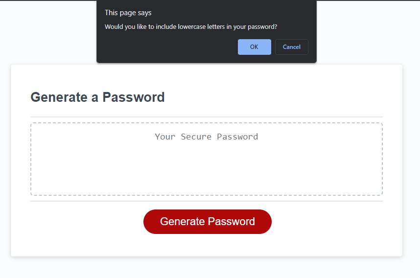

# Password Generator

## Description

In order to practice JavaScript fundamentals, I made an easy to use password generator. I am not the most creative when it comes to my passwords (and perhaps posting this publicly on a website for programmers isn't my smartest move), but this is a very easy way to get strong, secure passwords in the future. I learned a good bit about scope, array methods, and interfacing websites using prompts and alerts. It's not flashy, but it's honest work.

## Installation

[Access the website by clicking here!](https://redknight88.github.io/password-generator/)

## Usage

The application is very user friendly. Clicking on the button brings up a series of questions about what the password should consist of, as in what kinds of characters to include. After, the user inputs how long the password should be. When all that is answered, the password with the desired criteria appears on the webpage for you to easily copy to clipboard.

## Credits
N/A